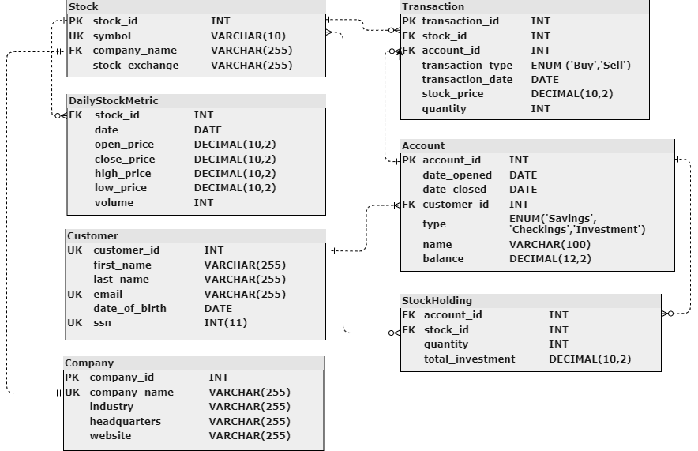

# Financial Data Management 

This project aims to manage financial market data and brokerage firm operations using a relational database system. It includes a database schema and a Python script to download historical stock data for popular stocks.

## Database Schema




1. **Stocks**: Stores information about individual stocks.
2. **DailyStockMetric**: Records daily metrics for each stock, including open, close, high, low, and volume data.
3. **Transactions**: Tracks transactions involving stocks, including buy/sell actions, prices, and quantities.
4. **Accounts**: Manages customer accounts, including opening and closing dates, account types, and balances.
5. **StockHolding**: Stores information about the stocks held in each account.
6. **Customers**: Stores customer information, including names, emails, dates of birth, and social security numbers.

## Entity Relation Diagram


## Database Usage

To use the .sql files of the project, follow these steps:

1. Ensure that you have the required SQL database management system installed and running.

2. Navigate to the project directory and locate the /sql_files directory.

3. Execute the following .sql files in the specified order:

   - Use the commands in the following file to create the database schema and tables. Ensure that you first create AND select the database before adding the tables:

        `/sql_files/create_db.sql`

    - Insert the stock into the database with the following commands:
  
        `/sql_files/insert_company_ and_stocks.sql` 

    - Insert the daily metrics into the database with the following commands:
  
        `/sql_files/insert_daily_metrics.sql`

    - Insert the customers and accounts into the database with the following commands:
  
        `/sql_files/insert_customers_and_accounts.sql`

    - Insert the transactions and holdings into the database with the following commands:
  
        `/sql_files/insert_transactions_and_holdings.sql`

4. After executing the above .sql files, you can now run `/sql_files/example_queries.sql` to perform various queries on the database.

## Data Download Script (Optional)

The `/stock_data/download_stock_data.py` script is provided to download historical stock data. The data is saved as CSV files for each stock.

The `/stock_data/sql_insertion_generator.py` script is provided to generate SQL commands to insert the downloaded data into the database.

## Stock Metrics Retrieval (Optional)

Example of how to retrieve stock metrics for a specific stock:

1. Install the required Python packages:
    ```
    pip install yfinance
    ```

2. Run the data download script from the project's home directory (do not navigate to /stock_data):
    ```
    python /stock_data/download_stock_data.py
    ```

3. The script will download historical stock data for the specified stocks and save it as CSV files.

4. Run the sql insertion generator script from the project's home directory (do not naviagte to /stock_data):
    ```
    python /stock_data/sql_insertion_generator.py
    ```
5. The generated sql commands are stored in `/sql_files/insert_daily_metrics.sql`
   

## Contributors

- Jason Whitlow

## License

This project is licensed under the [MIT License](LICENSE).
